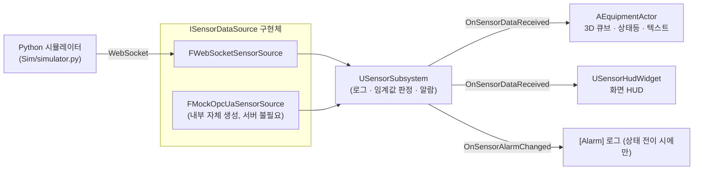

# FactoryTwin

Unreal Engine 5.7 기반 디지털 트윈 데모. 외부 센서 데이터를 실시간으로 수신해서 3D 씬과 UI에 반영하고, 임계값 초과 시 알람 이벤트를 발생시키는 최소 수직 슬라이스입니다.

## 개발 방식

이 프로젝트는 Claude(Anthropic)와의 페어 프로그래밍으로 만들어졌습니다 — 코드 대부분은 Claude가 작성했고, 요구사항 정의·설계 방향 결정·매 단계 검증은 사람이 직접 주도했습니다.

특히 UMG HUD가 화면에 전혀 렌더링되지 않는 버그가 있었는데(`AddToViewport()`는 성공을 보고하는데 실제로는 아무것도 안 보이는 상태), 이건 AI가 처음 설계할 때 만든 버그였습니다. 사람이 가설을 하나씩 세우고(World/GameInstance 문제인지 직접 A/B 테스트) → 레벨 블루프린트로 C++ 코드를 완전히 배제한 대조군을 만들어서(엔진 기본 위젯은 뜨는데 커스텀 위젯만 안 뜨는 것 확인) → 엔진 소스(`UserWidget.cpp`)까지 같이 파고들어서 근본 원인(`RebuildWidget()`이 아니라 `NativeConstruct()`에서 위젯 트리를 만들고 있었던 것)을 찾아냈습니다.

세션별로 "Claude가 한 것"과 "직접 진단·결정·트러블슈팅한 것"을 구분해서 기록한 상세 이력은 [WORKLOG.md](WORKLOG.md)에 있습니다.

## 아키텍처



`ISensorDataSource` 인터페이스 뒤에 두 가지 구현체가 있습니다:
- **`FWebSocketSensorSource`** — 실제 WebSocket으로 외부(현재는 Python 시뮬레이터)에서 데이터를 받음
- **`FMockOpcUaSensorSource`** — 실제 OPC UA 서버 없이 내부적으로 값을 생성하는 목업. 향후 real OPC UA 클라이언트로 교체될 자리 표시자이자, 인터페이스가 실제로 교체 가능함을 증명하는 용도

어느 쪽을 쓰든 `USensorSubsystem`부터 3D 액터, UI까지 소비자 쪽 코드는 전혀 바뀌지 않습니다.

## 주요 기능

- **센서 데이터 수신**: WebSocket 또는 내장 목업, `Config/DefaultGame.ini`에서 전환
- **3D 시각화**: 설비마다 큐브 + 상태등(PointLight) + 인월드 텍스트를 코드로 자동 생성 (에디터에서 수동 배치/머티리얼 제작 불필요)
- **UI HUD**: 화면 좌상단에 실시간 Temp/Press 텍스트, UMG 위젯도 전부 코드로 생성 (Widget Blueprint 에셋 없음)
- **임계값 알람**: Normal → Warning → Critical 상태 전이 시에만 로그/이벤트 발생 (매 틱 스팸 없음), 3단계 색상(초록/호박/빨강)이 액터·HUD에 동일하게 반영
- **설정 기반 다중 설비**: `KnownEquipmentIds`에 항목만 추가하면 코드 수정 없이 설비 자동 확장
- **재연결 안정성**: WebSocket 연결 끊김 시 1초 → 최대 30초까지 지수 백오프로 재시도

## 프로젝트 구조

```
Source/FactoryTwin/
├── DataSource/
│   ├── ISensorDataSource.h          # 데이터 소스 추상 인터페이스
│   ├── WebSocketSensorSource.*      # WebSocket 구현체
│   └── MockOpcUaSensorSource.*      # OPC UA 목업 구현체
├── Subsystems/
│   ├── SensorSubsystem.*            # 데이터 소스 소유, 임계값/알람 판정 (단일 소스)
│   └── FactoryTwinWorldSubsystem.*  # PIE 시작 시 설비 액터+HUD 자동 스폰
├── Visualization/
│   └── EquipmentActor.*             # 3D 설비 액터 (큐브/상태등/텍스트)
└── UI/
    └── SensorHudWidget.*            # 화면 HUD (코드 전용 UMG 위젯)

Sim/                                  # Python WebSocket 센서 시뮬레이터
Config/DefaultGame.ini                # DataSourceType, ServerUrl, KnownEquipmentIds
WORKLOG.md                            # 작업 이력 (Claude/본인 작업 구분 기록)
```

## 빌드 & 실행

**요구사항**: UE 5.7, Visual Studio 2026 (또는 호환 툴체인). WebSocket 모드로 테스트하려면 Python 3.9+.

```bash
"C:\Program Files\Epic Games\UE_5.7\Engine\Build\BatchFiles\Build.bat" FactoryTwinEditor Win64 Development -project="<repo>\FactoryTwin.uproject"
```

또는 `FactoryTwin.uproject` 더블클릭 → 에디터에서 빌드.

### 기본 실행 (시뮬레이터 불필요)

`DataSourceType`이 기본값 `OpcUaMock`이라, **파이썬 시뮬레이터 없이** PIE만 켜면 바로 값이 흐르고 액터/HUD/알람이 동작합니다. 빠른 반복 개발용 기본 설정입니다.

### WebSocket 모드로 실행

1. `Config/DefaultGame.ini`에서 `DataSourceType=WebSocket`으로 변경
2. `Sim/run_simulator.bat` 실행 (또는 `python Sim/simulator.py`)
3. UE 에디터에서 PIE 실행

값 변화를 빨리 보고 싶으면 시뮬레이터를 `FACTORYTWIN_SIM_FAST=1` 환경변수로 실행 (자세한 건 [Sim/README.md](Sim/README.md) 참고).

### Output Log에서 확인할 것

- `[Sensor]` — 매 틱 원시 값 (기본은 `Verbose`라 안 보임, 필요시 Output Log 필터에서 활성화)
- `[Alarm]` — 심각도 전이 시에만 (`NORMAL -> WARNING` 등)
- `[SensorSource]` / `[MockOpcUaSensorSource]` — 연결/재연결 상태

## 아직 없는 것

- 실제 OPC UA 클라이언트 (지금은 목업만 존재, 인터페이스만 준비됨)
- 알람에 대한 실질적 반응(화면 배너, 알람 히스토리, 외부 알림 등) — 지금은 색상 변화 + 로그뿐
- 자동화 테스트

자세한 작업 이력과 트러블슈팅 기록은 [WORKLOG.md](WORKLOG.md)에 있습니다.
